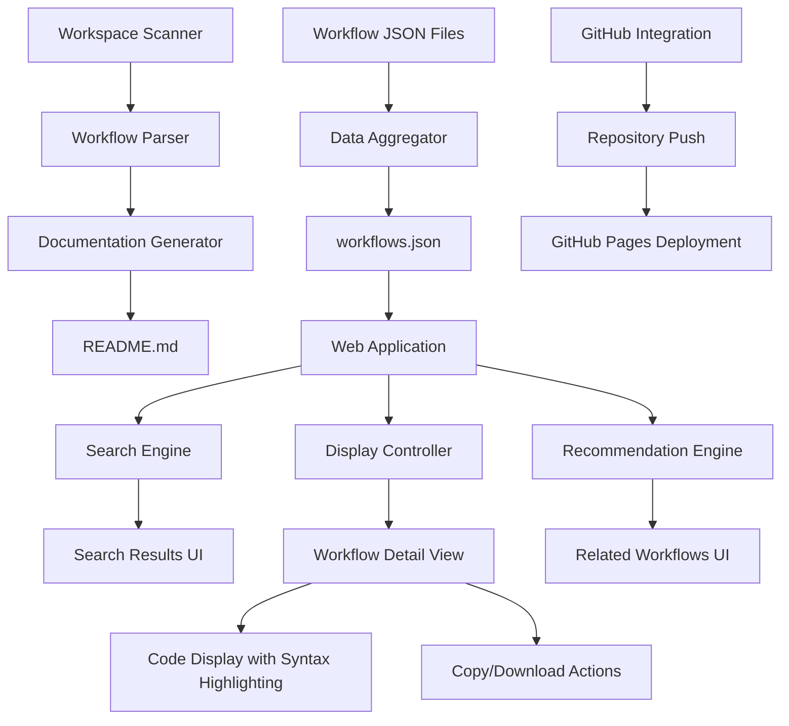
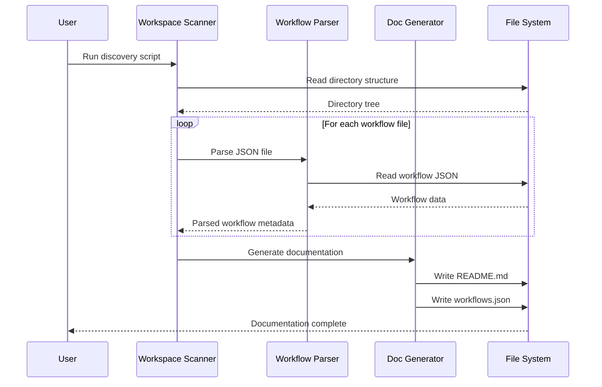
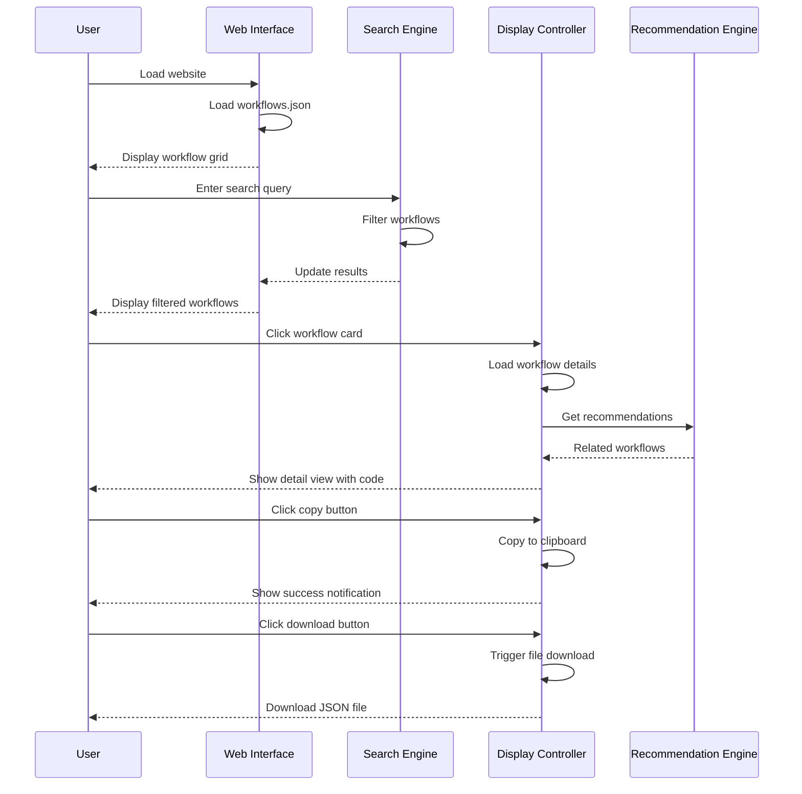

# Design Document: n8n Workflow Library Website

## Overview

The n8n Workflow Library Website is a comprehensive, client-side web application that provides an interactive interface for browsing, searching, and exploring n8n workflow JSON files. The system automatically discovers workflows from the workspace directory structure, generates documentation, and presents them through a responsive web interface with advanced search capabilities, syntax-highlighted code display, and intelligent workflow recommendations. The entire solution is built using pure HTML, CSS, and JavaScript without requiring build tools or server-side processing, making it easily deployable to static hosting platforms like GitHub Pages.

The system consists of three main components: (1) a workflow discovery and documentation generator that scans the workspace and creates a README.md file, (2) an interactive single-page application with search, filtering, and recommendation features, and (3) GitHub integration for version control and deployment. The architecture emphasizes client-side processing, responsive design, and user experience optimization.

## Architecture



## Sequence Diagrams

### Workflow Discovery and Documentation Generation




### User Interaction Flow



## Components and Interfaces

### Component 1: Workflow Scanner

**Purpose**: Discovers and parses all n8n workflow JSON files from the workspace directory structure

**Interface**:
```javascript
class WorkflowScanner {
  constructor(rootPath)
  async scanDirectory(path)
  async parseWorkflowFile(filePath)
  async generateWorkflowIndex()
  getWorkflowMetadata(workflowData)
}
```

**Responsibilities**:
- Recursively scan workspace directories for JSON files
- Parse workflow JSON files and extract metadata
- Generate aggregated workflow index (workflows.json)
- Handle file system errors gracefully


### Component 2: Documentation Generator

**Purpose**: Creates comprehensive README.md documentation from discovered workflows

**Interface**:
```javascript
class DocumentationGenerator {
  constructor(workflows)
  generateREADME()
  formatWorkflowSection(category, workflows)
  generateTableOfContents()
  generateStatistics()
}
```

**Responsibilities**:
- Generate structured README.md with table of contents
- Organize workflows by service category
- Include workflow statistics and metadata
- Format markdown with proper syntax

### Component 3: Search Engine

**Purpose**: Provides client-side search and filtering capabilities

**Interface**:
```javascript
class SearchEngine {
  constructor(workflows)
  search(query)
  filterByCategory(category)
  filterByTriggerType(triggerType)
  sortResults(results, sortBy)
  highlightMatches(text, query)
}
```

**Responsibilities**:
- Implement fuzzy search across workflow names, descriptions, and nodes
- Support multiple filter criteria (category, trigger type, node types)
- Rank search results by relevance
- Highlight matching terms in results

### Component 4: Display Controller

**Purpose**: Manages UI rendering and user interactions

**Interface**:
```javascript
class DisplayController {
  constructor(containerElement)
  renderWorkflowGrid(workflows)
  renderWorkflowDetail(workflow)
  renderCodeBlock(code, language)
  showNotification(message, type)
  updateUI(state)
}
```

**Responsibilities**:
- Render workflow cards in grid layout
- Display detailed workflow view with syntax highlighting
- Handle responsive layout adjustments
- Manage UI state transitions


### Component 5: Recommendation Engine

**Purpose**: Suggests related workflows based on similarity analysis

**Interface**:
```javascript
class RecommendationEngine {
  constructor(workflows)
  getRecommendations(workflow, limit)
  calculateSimilarity(workflow1, workflow2)
  extractFeatures(workflow)
  scoreByNodeOverlap(workflow1, workflow2)
  scoreByCategory(workflow1, workflow2)
}
```

**Responsibilities**:
- Analyze workflow patterns and node usage
- Calculate similarity scores between workflows
- Generate ranked recommendations
- Consider multiple similarity factors (nodes, category, trigger type)

### Component 6: Code Display Manager

**Purpose**: Handles syntax highlighting and code interaction features

**Interface**:
```javascript
class CodeDisplayManager {
  constructor(codeElement)
  highlightJSON(jsonString)
  copyToClipboard(text)
  downloadAsFile(content, filename)
  formatJSON(jsonObject)
}
```

**Responsibilities**:
- Apply syntax highlighting to JSON code
- Implement copy-to-clipboard functionality
- Generate downloadable JSON files
- Format and prettify JSON output

## Data Models

### Model 1: Workflow

```javascript
interface Workflow {
  id: string
  name: string
  description: string
  filePath: string
  category: string
  fileName: string
  nodes: Node[]
  connections: object
  triggerType: string
  nodeTypes: string[]
  active: boolean
  meta?: object
}
```

**Validation Rules**:
- `id` must be unique across all workflows
- `name` must be non-empty string
- `filePath` must be valid relative path
- `category` must match directory name
- `nodes` must be non-empty array


### Model 2: Node

```javascript
interface Node {
  id?: string
  name: string
  type: string
  position: [number, number]
  parameters: object
  credentials?: object
  typeVersion: number
}
```

**Validation Rules**:
- `name` must be non-empty string
- `type` must follow n8n node type format (e.g., "n8n-nodes-base.gmail")
- `position` must be array of two numbers
- `typeVersion` must be positive integer

### Model 3: SearchResult

```javascript
interface SearchResult {
  workflow: Workflow
  score: number
  matches: Match[]
  highlightedName: string
}
```

**Validation Rules**:
- `score` must be between 0 and 1
- `matches` array contains matched fields and positions
- `highlightedName` contains HTML with highlighted terms

### Model 4: WorkflowIndex

```javascript
interface WorkflowIndex {
  version: string
  generatedAt: string
  totalWorkflows: number
  categories: string[]
  workflows: Workflow[]
}
```

**Validation Rules**:
- `version` follows semantic versioning
- `generatedAt` is ISO 8601 timestamp
- `totalWorkflows` matches workflows array length
- `categories` contains unique category names

## Algorithmic Pseudocode

### Main Workflow Discovery Algorithm

```javascript
async function discoverWorkflows(rootPath) {
  // INPUT: rootPath - absolute path to workspace root
  // OUTPUT: WorkflowIndex object with all discovered workflows
  // PRECONDITION: rootPath exists and is readable
  // POSTCONDITION: All valid workflow JSON files are discovered and parsed
  
  const workflows = []
  const categories = new Set()
  
  // Get all subdirectories (categories)
  const directories = await fs.readdir(rootPath, { withFileTypes: true })
  const categoryDirs = directories.filter(d => d.isDirectory() && !d.name.startsWith('.'))
  
  // LOOP INVARIANT: All processed directories have been scanned for workflows
  for (const dir of categoryDirs) {
    const categoryPath = path.join(rootPath, dir.name)
    const files = await fs.readdir(categoryPath)
    
    // LOOP INVARIANT: All processed files have been validated and parsed
    for (const file of files) {
      if (file.endsWith('.json')) {
        try {
          const filePath = path.join(categoryPath, file)
          const content = await fs.readFile(filePath, 'utf8')
          const workflowData = JSON.parse(content)
          
          // Extract metadata and create workflow object
          const workflow = {
            id: generateId(filePath),
            name: workflowData.name || extractNameFromFilename(file),
            description: extractDescription(workflowData),
            filePath: path.relative(rootPath, filePath),
            category: dir.name,
            fileName: file,
            nodes: workflowData.nodes || [],
            connections: workflowData.connections || {},
            triggerType: detectTriggerType(workflowData),
            nodeTypes: extractNodeTypes(workflowData.nodes),
            active: workflowData.active || false,
            meta: workflowData.meta
          }
          
          workflows.push(workflow)
          categories.add(dir.name)
        } catch (error) {
          console.error(`Failed to parse ${file}:`, error.message)
          // Continue processing other files
        }
      }
    }
  }
  
  // POSTCONDITION: workflows array contains all valid workflows
  // POSTCONDITION: categories set contains all unique category names
  return {
    version: '1.0.0',
    generatedAt: new Date().toISOString(),
    totalWorkflows: workflows.length,
    categories: Array.from(categories).sort(),
    workflows: workflows
  }
}
```

**Preconditions:**
- rootPath is a valid, readable directory path
- User has read permissions for all workflow files
- Workflow JSON files follow n8n format

**Postconditions:**
- All valid workflow files are discovered and parsed
- Invalid files are logged but don't stop processing
- WorkflowIndex contains complete metadata
- Categories are sorted alphabetically

**Loop Invariants:**
- First loop: All previously processed directories have been fully scanned
- Second loop: All previously processed files have been validated and added to workflows array


### Search Algorithm with Fuzzy Matching

```javascript
function searchWorkflows(query, workflows) {
  // INPUT: query - search string, workflows - array of Workflow objects
  // OUTPUT: Array of SearchResult objects sorted by relevance score
  // PRECONDITION: query is non-empty string, workflows is valid array
  // POSTCONDITION: Results are sorted by score (highest first)
  
  if (!query || query.trim().length === 0) {
    return workflows.map(w => ({ workflow: w, score: 1, matches: [] }))
  }
  
  const queryLower = query.toLowerCase().trim()
  const queryTerms = queryLower.split(/\s+/)
  const results = []
  
  // LOOP INVARIANT: All processed workflows have been scored
  for (const workflow of workflows) {
    let score = 0
    const matches = []
    
    // Score by name match (highest weight)
    const nameLower = workflow.name.toLowerCase()
    if (nameLower.includes(queryLower)) {
      score += 10
      matches.push({ field: 'name', term: queryLower })
    } else {
      // Check individual terms
      for (const term of queryTerms) {
        if (nameLower.includes(term)) {
          score += 5
          matches.push({ field: 'name', term: term })
        }
      }
    }
    
    // Score by category match
    const categoryLower = workflow.category.toLowerCase()
    if (categoryLower.includes(queryLower)) {
      score += 8
      matches.push({ field: 'category', term: queryLower })
    }
    
    // Score by node type matches
    for (const nodeType of workflow.nodeTypes) {
      const nodeTypeLower = nodeType.toLowerCase()
      if (nodeTypeLower.includes(queryLower)) {
        score += 3
        matches.push({ field: 'nodeType', term: queryLower })
      }
    }
    
    // Score by description match
    if (workflow.description) {
      const descLower = workflow.description.toLowerCase()
      if (descLower.includes(queryLower)) {
        score += 2
        matches.push({ field: 'description', term: queryLower })
      }
    }
    
    // Only include workflows with matches
    if (score > 0) {
      // Normalize score to 0-1 range
      const normalizedScore = Math.min(score / 20, 1)
      results.push({
        workflow: workflow,
        score: normalizedScore,
        matches: matches,
        highlightedName: highlightText(workflow.name, queryTerms)
      })
    }
  }
  
  // Sort by score descending
  results.sort((a, b) => b.score - a.score)
  
  // POSTCONDITION: Results are sorted by relevance score
  // POSTCONDITION: All results have score > 0
  return results
}
```

**Preconditions:**
- query is a string (may be empty)
- workflows is a valid array of Workflow objects
- Each workflow has required fields (name, category, nodeTypes)

**Postconditions:**
- Results are sorted by score in descending order
- All returned results have score > 0
- Empty query returns all workflows with score 1
- Scores are normalized to 0-1 range

**Loop Invariants:**
- All previously processed workflows have been scored and added to results if score > 0
- Score calculation is consistent across all workflows


### Recommendation Algorithm

```javascript
function getRecommendations(targetWorkflow, allWorkflows, limit = 5) {
  // INPUT: targetWorkflow - Workflow object, allWorkflows - array of all workflows, limit - max recommendations
  // OUTPUT: Array of recommended Workflow objects sorted by similarity
  // PRECONDITION: targetWorkflow exists in allWorkflows, limit > 0
  // POSTCONDITION: Returns at most 'limit' workflows, sorted by similarity score
  
  const recommendations = []
  
  // Extract features from target workflow
  const targetFeatures = {
    category: targetWorkflow.category,
    nodeTypes: new Set(targetWorkflow.nodeTypes),
    triggerType: targetWorkflow.triggerType,
    nodeCount: targetWorkflow.nodes.length
  }
  
  // LOOP INVARIANT: All processed workflows have been scored for similarity
  for (const workflow of allWorkflows) {
    // Skip the target workflow itself
    if (workflow.id === targetWorkflow.id) {
      continue
    }
    
    let similarityScore = 0
    
    // Category similarity (weight: 0.3)
    if (workflow.category === targetFeatures.category) {
      similarityScore += 0.3
    }
    
    // Node type overlap (weight: 0.5)
    const workflowNodeTypes = new Set(workflow.nodeTypes)
    const intersection = new Set(
      [...targetFeatures.nodeTypes].filter(x => workflowNodeTypes.has(x))
    )
    const union = new Set([...targetFeatures.nodeTypes, ...workflowNodeTypes])
    
    if (union.size > 0) {
      const jaccardSimilarity = intersection.size / union.size
      similarityScore += 0.5 * jaccardSimilarity
    }
    
    // Trigger type similarity (weight: 0.1)
    if (workflow.triggerType === targetFeatures.triggerType) {
      similarityScore += 0.1
    }
    
    // Node count similarity (weight: 0.1)
    const nodeCountDiff = Math.abs(workflow.nodes.length - targetFeatures.nodeCount)
    const nodeCountSimilarity = 1 / (1 + nodeCountDiff / 10)
    similarityScore += 0.1 * nodeCountSimilarity
    
    recommendations.push({
      workflow: workflow,
      score: similarityScore
    })
  }
  
  // Sort by similarity score descending
  recommendations.sort((a, b) => b.score - a.score)
  
  // Return top N recommendations
  const topRecommendations = recommendations.slice(0, limit)
  
  // POSTCONDITION: Returns at most 'limit' workflows
  // POSTCONDITION: Results are sorted by similarity score (highest first)
  // POSTCONDITION: Target workflow is not included in results
  return topRecommendations.map(r => r.workflow)
}
```

**Preconditions:**
- targetWorkflow is a valid Workflow object
- allWorkflows is a non-empty array of Workflow objects
- limit is a positive integer
- targetWorkflow exists in allWorkflows

**Postconditions:**
- Returns at most 'limit' workflows
- Results are sorted by similarity score in descending order
- Target workflow is excluded from recommendations
- Similarity scores are in range [0, 1]

**Loop Invariants:**
- All previously processed workflows have been scored
- Target workflow is never added to recommendations
- Similarity scores are calculated consistently


## Key Functions with Formal Specifications

### Function 1: generateREADME()

```javascript
function generateREADME(workflowIndex) {
  // Generates comprehensive README.md documentation
  // Returns: string (markdown content)
}
```

**Preconditions:**
- workflowIndex is a valid WorkflowIndex object
- workflowIndex.workflows is a non-empty array
- workflowIndex.categories contains all unique categories

**Postconditions:**
- Returns valid markdown string
- Includes table of contents with links to all categories
- Each category section lists all workflows in that category
- Includes statistics (total workflows, categories count)
- Markdown is properly formatted and valid

**Loop Invariants:** N/A (uses array methods)

### Function 2: copyToClipboard()

```javascript
async function copyToClipboard(text) {
  // Copies text to system clipboard
  // Returns: Promise<boolean> (success status)
}
```

**Preconditions:**
- text is a non-empty string
- Browser supports Clipboard API or fallback method
- User has granted clipboard permissions (if required)

**Postconditions:**
- Returns true if copy succeeded, false otherwise
- Text is available in system clipboard on success
- No side effects on failure
- Works across modern browsers

**Loop Invariants:** N/A (single operation)

### Function 3: downloadWorkflow()

```javascript
function downloadWorkflow(workflow) {
  // Triggers browser download of workflow JSON file
  // Returns: void
}
```

**Preconditions:**
- workflow is a valid Workflow object
- workflow contains valid JSON-serializable data
- Browser supports Blob and URL.createObjectURL

**Postconditions:**
- Browser download is triggered
- Downloaded file contains formatted JSON
- Filename matches workflow.fileName
- Original workflow object is unchanged

**Loop Invariants:** N/A (single operation)

### Function 4: highlightJSON()

```javascript
function highlightJSON(jsonString) {
  // Applies syntax highlighting to JSON string
  // Returns: string (HTML with syntax highlighting)
}
```

**Preconditions:**
- jsonString is a valid JSON string
- JSON can be parsed without errors

**Postconditions:**
- Returns HTML string with syntax-highlighted JSON
- All JSON tokens are properly classified (string, number, boolean, null, key)
- HTML is safe (no XSS vulnerabilities)
- Formatting preserves JSON structure

**Loop Invariants:**
- For character iteration: All previously processed characters are properly classified and wrapped


### Function 5: initializeApp()

```javascript
async function initializeApp() {
  // Initializes the web application
  // Returns: Promise<void>
}
```

**Preconditions:**
- DOM is fully loaded
- workflows.json file exists and is accessible
- Required DOM elements exist (search input, workflow container, etc.)

**Postconditions:**
- workflows.json is loaded and parsed
- Event listeners are attached to UI elements
- Initial workflow grid is rendered
- Search engine is initialized
- Application is ready for user interaction

**Loop Invariants:** N/A (initialization sequence)

## Example Usage

### Example 1: Workflow Discovery Script

```javascript
// Node.js script to discover and index workflows
const fs = require('fs').promises
const path = require('path')

async function main() {
  const rootPath = process.cwd()
  
  // Discover all workflows
  const workflowIndex = await discoverWorkflows(rootPath)
  
  // Generate README.md
  const docGenerator = new DocumentationGenerator(workflowIndex.workflows)
  const readmeContent = docGenerator.generateREADME()
  await fs.writeFile('README.md', readmeContent, 'utf8')
  
  // Generate workflows.json for web app
  await fs.writeFile(
    'workflows.json',
    JSON.stringify(workflowIndex, null, 2),
    'utf8'
  )
  
  console.log(`✓ Discovered ${workflowIndex.totalWorkflows} workflows`)
  console.log(`✓ Generated README.md`)
  console.log(`✓ Generated workflows.json`)
}

main().catch(console.error)
```

### Example 2: Web Application Initialization

```javascript
// Initialize the web application
document.addEventListener('DOMContentLoaded', async () => {
  try {
    // Load workflow data
    const response = await fetch('workflows.json')
    const workflowIndex = await response.json()
    
    // Initialize components
    const searchEngine = new SearchEngine(workflowIndex.workflows)
    const displayController = new DisplayController(
      document.getElementById('workflow-container')
    )
    const recommendationEngine = new RecommendationEngine(workflowIndex.workflows)
    
    // Render initial view
    displayController.renderWorkflowGrid(workflowIndex.workflows)
    
    // Setup search
    const searchInput = document.getElementById('search-input')
    searchInput.addEventListener('input', (e) => {
      const results = searchEngine.search(e.target.value)
      displayController.renderWorkflowGrid(results.map(r => r.workflow))
    })
    
    console.log('✓ Application initialized')
  } catch (error) {
    console.error('Failed to initialize application:', error)
  }
})
```

### Example 3: Search and Display Workflow

```javascript
// User searches for "Gmail" workflows
const searchQuery = 'Gmail'
const searchResults = searchEngine.search(searchQuery)

// Display results
displayController.renderWorkflowGrid(searchResults.map(r => r.workflow))

// User clicks on a workflow
const selectedWorkflow = searchResults[0].workflow

// Display workflow details
displayController.renderWorkflowDetail(selectedWorkflow)

// Get and display recommendations
const recommendations = recommendationEngine.getRecommendations(
  selectedWorkflow,
  5
)
displayController.renderRecommendations(recommendations)
```

### Example 4: Copy and Download Workflow

```javascript
// User clicks copy button
const copyButton = document.getElementById('copy-btn')
copyButton.addEventListener('click', async () => {
  const workflowJSON = JSON.stringify(currentWorkflow, null, 2)
  const success = await copyToClipboard(workflowJSON)
  
  if (success) {
    displayController.showNotification('Copied to clipboard!', 'success')
  } else {
    displayController.showNotification('Failed to copy', 'error')
  }
})

// User clicks download button
const downloadButton = document.getElementById('download-btn')
downloadButton.addEventListener('click', () => {
  downloadWorkflow(currentWorkflow)
  displayController.showNotification('Download started', 'info')
})
```


## Correctness Properties

### Property 1: Workflow Discovery Completeness
**∀ valid JSON file f in workspace directories, f is included in workflowIndex.workflows OR f is logged as error**

All valid n8n workflow JSON files in the workspace must be discovered and included in the workflow index, or if parsing fails, the error must be logged. No valid workflow should be silently skipped.

### Property 2: Search Result Relevance
**∀ search query q, ∀ result r in searchResults(q), r.score > 0 AND r contains match for q**

Every search result must have a positive relevance score and contain at least one field that matches the search query. Empty queries return all workflows with score 1.

### Property 3: Recommendation Uniqueness
**∀ workflow w, ∀ recommendation r in getRecommendations(w), r.id ≠ w.id**

The recommendation engine must never recommend the target workflow itself. All recommendations must be distinct from the input workflow.

### Property 4: JSON Syntax Highlighting Safety
**∀ JSON string j, highlightJSON(j) produces XSS-safe HTML**

The syntax highlighting function must escape all user-controlled content to prevent XSS attacks. The output HTML must be safe to inject into the DOM.

### Property 5: Clipboard Operation Idempotency
**∀ text t, copyToClipboard(t) does not modify t**

The copy-to-clipboard operation must not modify the input text. The original data must remain unchanged after the operation.

### Property 6: Download File Integrity
**∀ workflow w, downloaded file content equals JSON.stringify(w, null, 2)**

The downloaded workflow file must contain exactly the formatted JSON representation of the workflow object, with no data loss or corruption.

### Property 7: Category Consistency
**∀ workflow w in workflowIndex.workflows, w.category ∈ workflowIndex.categories**

Every workflow's category must be listed in the categories array of the workflow index. No orphaned categories should exist.

### Property 8: Search Performance
**∀ query q, ∀ workflow array W, searchWorkflows(q, W) completes in O(n*m) time where n = |W| and m = avg query terms**

The search algorithm must have linear time complexity relative to the number of workflows and query terms. Performance must be acceptable for client-side execution.

## Error Handling

### Error Scenario 1: Invalid Workflow JSON

**Condition**: Workflow JSON file cannot be parsed or is malformed
**Response**: 
- Log error with file path and error message
- Continue processing other workflow files
- Exclude invalid workflow from index
**Recovery**: 
- User can fix JSON syntax and re-run discovery script
- Invalid files don't prevent other workflows from being indexed

### Error Scenario 2: Missing workflows.json

**Condition**: Web application cannot load workflows.json file
**Response**:
- Display user-friendly error message
- Show instructions to run discovery script
- Prevent application initialization
**Recovery**:
- User runs discovery script to generate workflows.json
- User refreshes the page

### Error Scenario 3: Clipboard API Not Supported

**Condition**: Browser doesn't support Clipboard API
**Response**:
- Fall back to legacy document.execCommand('copy') method
- If both methods fail, show error notification
- Provide manual copy instructions
**Recovery**:
- User manually selects and copies text
- User upgrades to modern browser


### Error Scenario 4: Search Query Too Long

**Condition**: User enters extremely long search query (>1000 characters)
**Response**:
- Truncate query to reasonable length (1000 chars)
- Show warning notification
- Process truncated query normally
**Recovery**:
- User refines search query to be more specific
- Search continues to function normally

### Error Scenario 5: Network Error Loading Workflow Data

**Condition**: fetch() fails to load workflows.json due to network error
**Response**:
- Display error message with retry button
- Log error details to console
- Prevent application initialization
**Recovery**:
- User clicks retry button to reload data
- User checks network connection
- User refreshes page

### Error Scenario 6: Recommendation Engine No Results

**Condition**: No similar workflows found for recommendation
**Response**:
- Return empty array
- Display "No similar workflows found" message
- Don't show recommendation section
**Recovery**:
- Normal operation, not an error state
- User can browse other workflows manually

## Testing Strategy

### Unit Testing Approach

**Test Coverage Goals**: 80% code coverage for core functions

**Key Test Cases**:

1. **Workflow Discovery Tests**
   - Test discovery of workflows in nested directories
   - Test handling of invalid JSON files
   - Test extraction of workflow metadata
   - Test generation of workflow index structure

2. **Search Engine Tests**
   - Test exact name matches
   - Test partial matches
   - Test multi-term queries
   - Test empty query handling
   - Test special character handling
   - Test score calculation accuracy

3. **Recommendation Engine Tests**
   - Test similarity calculation
   - Test category-based recommendations
   - Test node overlap scoring
   - Test exclusion of target workflow
   - Test limit parameter enforcement

4. **Code Display Tests**
   - Test JSON syntax highlighting
   - Test HTML escaping for XSS prevention
   - Test formatting of nested JSON
   - Test handling of large JSON files

5. **Clipboard Operations Tests**
   - Test successful copy operation
   - Test fallback mechanism
   - Test error handling
   - Test data integrity

**Testing Framework**: Jest for Node.js components, Vitest for browser components

### Property-Based Testing Approach

**Property Test Library**: fast-check (JavaScript)

**Properties to Test**:

1. **Search Idempotency**: Searching twice with same query returns identical results
2. **Recommendation Symmetry**: If A is similar to B, B should be similar to A (within threshold)
3. **JSON Round-Trip**: Parse and stringify workflow maintains data integrity
4. **Score Bounds**: All search and recommendation scores are in range [0, 1]
5. **Category Membership**: All workflows belong to exactly one category

**Example Property Test**:
```javascript
import fc from 'fast-check'

test('search scores are always between 0 and 1', () => {
  fc.assert(
    fc.property(
      fc.string(), // arbitrary search query
      fc.array(workflowArbitrary), // arbitrary workflow array
      (query, workflows) => {
        const results = searchWorkflows(query, workflows)
        return results.every(r => r.score >= 0 && r.score <= 1)
      }
    )
  )
})
```

### Integration Testing Approach

**Integration Test Scenarios**:

1. **End-to-End Workflow Discovery**
   - Create test directory structure with sample workflows
   - Run discovery script
   - Verify README.md and workflows.json are generated correctly
   - Verify all workflows are indexed

2. **Web Application Loading**
   - Start local web server
   - Load application in browser
   - Verify workflows.json is loaded
   - Verify initial grid is rendered

3. **Search and Display Flow**
   - Enter search query
   - Verify filtered results appear
   - Click workflow card
   - Verify detail view displays
   - Verify recommendations appear

4. **Copy and Download Flow**
   - Open workflow detail view
   - Click copy button
   - Verify clipboard contains JSON
   - Click download button
   - Verify file is downloaded

**Testing Tools**: Playwright for browser automation, Supertest for API testing


## Performance Considerations

### Client-Side Performance

**Challenge**: Loading and searching through 100+ workflows in the browser

**Optimization Strategies**:
1. **Lazy Loading**: Load workflow details on-demand, not all at once
2. **Virtual Scrolling**: Render only visible workflow cards in viewport
3. **Debounced Search**: Delay search execution until user stops typing (300ms)
4. **Indexed Search**: Pre-build search index for faster lookups
5. **Web Workers**: Offload search and recommendation calculations to background thread

**Performance Targets**:
- Initial page load: < 2 seconds
- Search response time: < 100ms for 100 workflows
- Workflow detail view: < 50ms to render
- Smooth scrolling: 60 FPS

### File Size Optimization

**Challenge**: Keep workflows.json file size manageable

**Optimization Strategies**:
1. **Minified JSON**: Remove unnecessary whitespace in workflows.json
2. **Selective Data**: Include only essential fields in workflow index
3. **Compression**: Enable gzip compression on web server
4. **Code Splitting**: Separate syntax highlighting library (load on-demand)

**Size Targets**:
- workflows.json: < 500KB for 100 workflows
- HTML/CSS/JS bundle: < 100KB (uncompressed)
- Syntax highlighting library: Load only when viewing workflow details

### Search Performance

**Challenge**: Fast search across multiple fields with fuzzy matching

**Optimization Strategy**:
1. **Pre-computed Indexes**: Build lowercase indexes for all searchable fields
2. **Early Termination**: Stop processing if score threshold not met
3. **Field Prioritization**: Search high-value fields (name, category) first
4. **Result Limiting**: Cap results at 50 workflows

**Algorithm Complexity**:
- Time: O(n * m) where n = workflows, m = query terms
- Space: O(n) for search results
- Acceptable for n < 1000 workflows

## Security Considerations

### XSS Prevention

**Threat**: Malicious workflow JSON could contain script tags or event handlers

**Mitigation Strategies**:
1. **HTML Escaping**: Escape all user-controlled content before rendering
2. **Content Security Policy**: Implement strict CSP headers
3. **DOMPurify**: Use sanitization library for HTML content
4. **Safe JSON Rendering**: Use textContent instead of innerHTML where possible

**Implementation**:
```javascript
function escapeHTML(str) {
  const div = document.createElement('div')
  div.textContent = str
  return div.innerHTML
}

// CSP Header
Content-Security-Policy: default-src 'self'; script-src 'self'; style-src 'self' 'unsafe-inline'
```

### Data Validation

**Threat**: Malformed or malicious workflow JSON could crash the application

**Mitigation Strategies**:
1. **JSON Schema Validation**: Validate workflow structure before processing
2. **Try-Catch Blocks**: Wrap JSON parsing in error handlers
3. **Type Checking**: Verify expected data types before use
4. **Size Limits**: Reject workflows exceeding size limits

### Dependency Security

**Threat**: Third-party libraries may contain vulnerabilities

**Mitigation Strategies**:
1. **Minimal Dependencies**: Use only essential libraries
2. **Regular Updates**: Keep dependencies up to date
3. **Security Audits**: Run npm audit regularly
4. **Subresource Integrity**: Use SRI for CDN resources

**Dependencies**:
- Syntax highlighting: Prism.js or Highlight.js (well-maintained, security-focused)
- No other runtime dependencies (pure vanilla JS)

### GitHub Repository Security

**Threat**: Sensitive data accidentally committed to repository

**Mitigation Strategies**:
1. **Gitignore**: Exclude credentials, API keys, and sensitive files
2. **Pre-commit Hooks**: Scan for secrets before commit
3. **Public Repository**: Assume all code is public, no secrets in code
4. **Environment Variables**: Use environment variables for configuration

## Dependencies

### Runtime Dependencies

**Node.js (for discovery script)**:
- Version: >= 14.0.0
- Purpose: File system operations, JSON parsing
- Modules: fs/promises, path

**Browser (for web application)**:
- Modern browsers with ES6+ support
- Chrome 90+, Firefox 88+, Safari 14+, Edge 90+
- Required APIs: Fetch API, Clipboard API, localStorage

### Development Dependencies

**Testing**:
- Jest (^29.0.0): Unit testing framework
- fast-check (^3.0.0): Property-based testing
- Playwright (^1.40.0): Browser automation for integration tests

**Code Quality**:
- ESLint (^8.0.0): JavaScript linting
- Prettier (^3.0.0): Code formatting

**Build Tools** (optional):
- None required for production (pure HTML/CSS/JS)
- http-server or similar for local development

### External Libraries (CDN)

**Syntax Highlighting**:
- Prism.js (^1.29.0) or Highlight.js (^11.9.0)
- Purpose: JSON syntax highlighting
- Loading: On-demand when viewing workflow details

**Optional Enhancements**:
- Fuse.js (^7.0.0): Advanced fuzzy search (if needed)
- Chart.js (^4.0.0): Workflow statistics visualization (future enhancement)

### GitHub Integration

**Requirements**:
- Git (>= 2.0.0)
- GitHub account
- GitHub CLI (gh) or git command-line tools

**GitHub Actions** (optional):
- Automated deployment to GitHub Pages
- Workflow discovery script runs on push
- Automatic README.md updates
